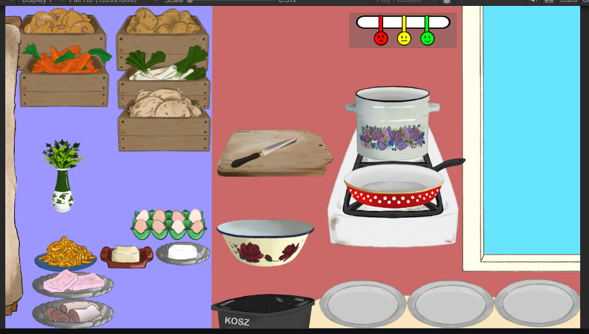
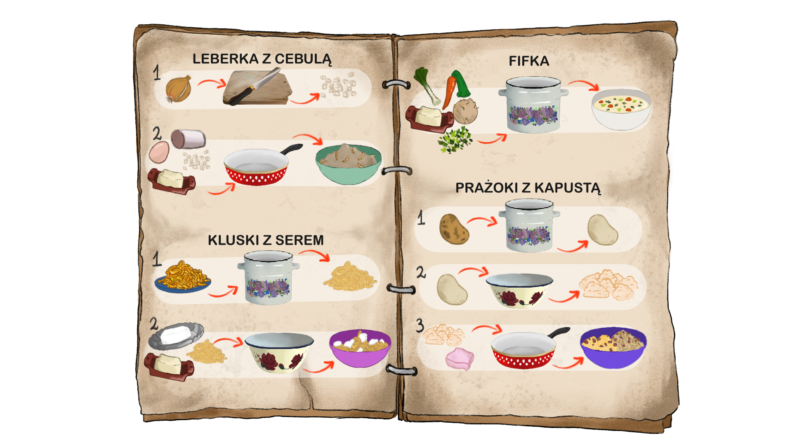

## Technologies

- Unity
- C#

## Motivation

This game was created as the fundamental part of my thesis. For the thesis I conducted a thorough analysis of a number of selected existing games and formulated a system architecture basing on that.
I also analysed and appropriated a number of recipes with local cultural importance to include them in the game. 
The game was then tested with ~60 players in three difficulty variants, based on a selected system parameter value.
The results were analysed with game-generated logs, the NASA-TLX model and two Newzoo models for some basic demographics.

## Implementation

The game was implemented in Unity Engine with C# scripts. I also used the DoTween library for some interface animations.

A high priority in the system design was flexibility and ease of changing some key parameters. 
To this end I extensively used ScriptableObjects as game configuration file implementation.

The key system elements included: ingredients & recipes, the main buffer, the processing stations and processing action definitions, the clients, the logging module and the GameManager module.
I used prefabs to define the basic structures of in-game elements such as the client template, the ingredient source template, etc.

Aside from what was the most important for the system, which was the main focus of the thesis, some elements were key to make it a game experience.
This included animations and interaction hints, status & score displays, the recipe book, level-select, level-intro and summary screens.

All of this is described in detail within the dissertation.
**If you would like to see the dissertation or get a demo of the game, please contact me by [email](mailto:ludziejewski.kontakt@gmail.com).**

## Conclusion

The survey analysis confirmed that the key balancing parameter values were estimated correctly, if a little low.

As for the game, we're currently considering pushing it for ZTGK 2025.
