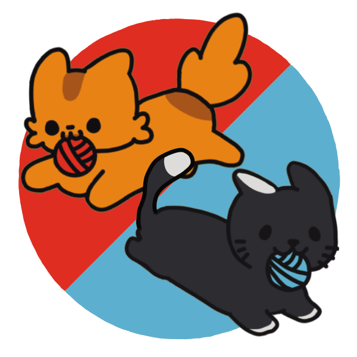

## Technologies

- Unity engine

## Motivation

Submission to the Digital Night Jam 3 (2024 edition), organized by the Digital Night Studio game development circle, which I'm a part of.

## Implementation

The jam's topic was 'speech'. In our game you control a pair of cats, trying to communicate their needs by wrapping some yarn around letter-blocks scattered on the floor.
Of course the yarn becomes an obstacle for both you and your opponent cat, so beware and think fast!

During the development I took the role of one of the two programmers and am responsible for large parts of the gameplay logic, the UI programming and the audio player.

## Conclusion

We may not have achieved a podium spot but the event was a lot of fun and once again taught me more about Unity. Definitely left it content.
