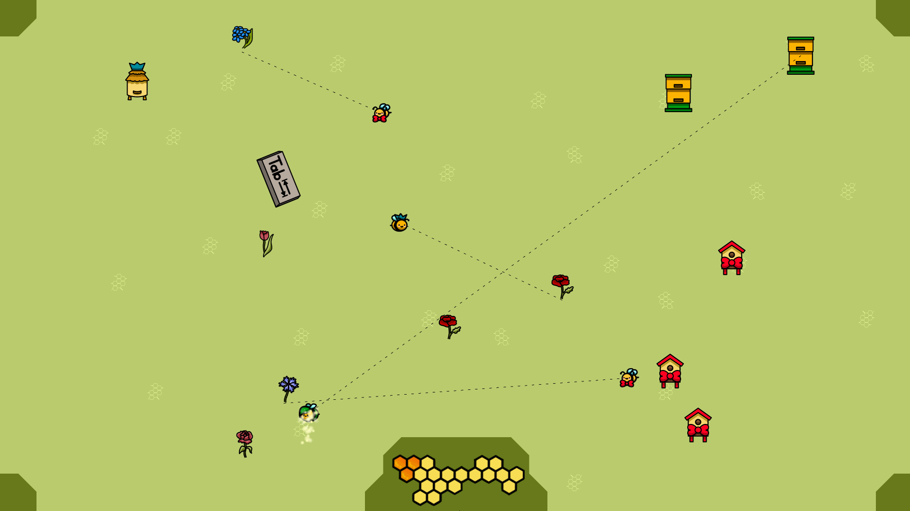

## Technologies

- GameMaker engine

## Motivation

My first ever gamejam, as well as one of the first games I've made. \
We finished #1.

## Implementation

The jam's topic was 'tabula rasa', which we decided to take quite literally and twist it into a pun of tab-ula-rasa.
In the game you control a flying 'tab' button and control bees flying between hives and flowers, creating honey for you. You need to be careful however, as each kind of bee is not very tolerant towards the others.

During the development I took the role of one of the two programmers and am responsible for most of the gameplay logic.

## Conclusion

The gamejam was really fun and left me with lots of motivation to go take part in more of them in the future!